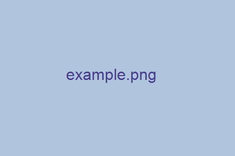

# 欢迎

<!-- 原内容：这是由 Quarto 生成的网页，同时会输出 `index.tex`。 -->
这是由 Quarto 生成的网页，同时会输出整本书的 `.tex` 文件。

## 目录

本页目录由 Quarto 根据标题自动生成，不需要手写。

## 图片

{width=60% fig-align="center"}

## 代码高亮

```python
def hello(name):
    return f"Hello, {name}!"

print(hello("Quarto"))
